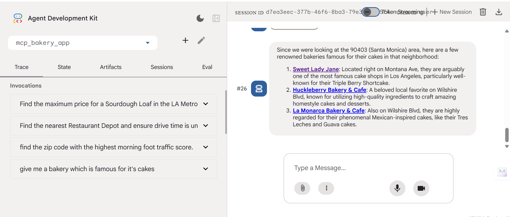
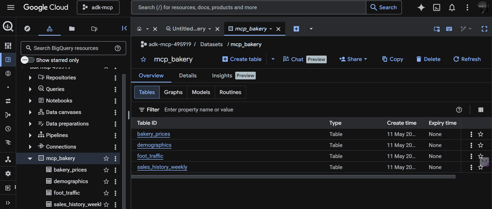

## AI Bakery Intelligence Agent

An AI-powered bakery business intelligence agent built using **Google ADK**, **MCP (Model Context Protocol)**, **Gemini**, **BigQuery**, and **Google Maps APIs**.

This project helps analyze bakery business opportunities using:
-  Location intelligence
-  Foot traffic analysis
-  Competitor research
-  Pricing strategy
-  Revenue forecasting
-  Real-world maps validation

---

#  Live Demo

🔗 Live Application:  
https://bakery-agent-582484789707.asia-south1.run.app

🔗 GitHub Repository:  
https://github.com/mmeeghana/ai-bakery-agent

---

#  Tech Stack

- Google ADK
- Gemini 3 Pro
- MCP (Model Context Protocol)
- BigQuery
- Google Maps APIs
- Python
- Cloud Run
- Google Cloud Platform

---

#  Project Overview

This project demonstrates how AI agents can combine:
- Enterprise analytics from BigQuery
- Real-world geospatial intelligence from Google Maps
- MCP tool orchestration
- Gemini reasoning capabilities

The AI agent autonomously performs:
- Business analysis
- Market research
- Revenue forecasting
- Location validation
- Competitor analysis

---

#  Architecture Diagram


The AI Agent uses:
- Gemini for reasoning
- MCP servers for tool orchestration
- BigQuery for analytics
- Google Maps APIs for geospatial intelligence

---

#  Repository Structure

```text
launchmybakery/
├── data/
│   ├── demographics.csv
│   ├── bakery_prices.csv
│   ├── sales_history_weekly.csv
│   └── foot_traffic.csv
│
├── adk_agent/
│   └── mcp_bakery_app/
│       ├── agent.py
│       ├── tools.py
│       └── Dockerfile
│
├── setup/
│   ├── setup_bigquery.sh
│   └── setup_env.sh
│
├── cleanup/
│   └── cleanup_env.sh
│
└── README.md
```

## Setup Instructions

Follow these steps in **Google Cloud Shell** to provision the demo environment.

### 1. Clone the Repository
```bash
git clone https://github.com/mmeeghana/ai-bakery-agent.git
cd ai-bakery-agent
```

### 2. Authenticate with Google Cloud

Run the following command to authenticate with your Google Cloud account. This is required for the ADK to access BigQuery.

```bash
gcloud config set project [YOUR-PROJECT-ID]
gcloud auth application-default login
```

### 3. Configure Environment

Run the environment setup script. This script will:
*   Enable necessary Google Cloud APIs (Maps, BigQuery, remote MCP).
*   Create a restricted Google Maps Platform API Key.
*   Create a `.env` file with required environment variables.

```bash
chmod +x setup/setup_env.sh
./setup/setup_env.sh
```

### 4. Provision BigQuery

Run the setup script. This script automates the following:
*   Creates a Cloud Storage bucket.
*   Uploads the CSV data files.
*   Creates the `mcp_bakery` BigQuery dataset.
*   Loads the data into BigQuery tables.

```bash
chmod +x ./setup/setup_bigquery.sh
./setup/setup_bigquery.sh
```

### 5. Install ADK and Run Agent

Create a virtual environment, install the ADK, and run the agent.

```bash
# Create virtual environment
python3 -m venv .venv

# If the above fails, you may need to install python3-venv:
# apt update && apt install python3-venv

# Activate virtual environment
source .venv/bin/activate

# Install ADK
pip install google-adk==1.28.0

# Navigate to the app directory
cd adk_agent/

# Run the ADK web interface
adk web --allow_origins 'regex:https://.*\.cloudshell\.dev'
```


### 6. Chat with the Agent

Open the link provided by `adk web` in your browser. You can now chat with the agent and ask it questions about the bakery data.

**Sample Questions:**

*   "I’m looking to open my fourth bakery location in Los Angeles. I need a neighborhood with early activity. Find the zip code with the highest 'morning' foot traffic score."
*   "Can you search for 'Bakeries' in that zip code to see if it's saturated? If there are too many, check for 'Specialty Coffee' shops, so I can position myself near them to capture foot traffic."
*    "Okay and I want to position this as a premium brand. What is the maximum price being charged for a 'Sourdough Loaf' in the LA Metro area?"
*    "Now I want a revenue projection for December 2025. Look at my sales history and take data from my best performing store for the 'Sourdough Loaf'. Run a forecast for December 2025 to estimate the quantity I'll sell. Then, calculate the projected total revenue using just under the premium price we found (let's use $18)"
*    "That'll cover my rent. Lastly, let's verify logistics. Find the closest "Restaurant Depot" to the proposed area and make sure that drive time is under 30 minutes for daily restocking."

To abort the ADK session in Cloud Shell, press `Ctrl+C`.

### 7. Cleanup

To avoid incurring ongoing costs for BigQuery storage or other Google Cloud resources, you can run the cleanup script. This script will delete the BigQuery dataset, the Cloud Storage bucket, and the API keys created during setup. Navigate back to the root directory of the repository and run the following command:

```bash
chmod +x cleanup/cleanup_env.sh
./cleanup/cleanup_env.sh
```

## Cloud Run Deployment
This project is deployed using Google Cloud Run.

Deployment command:
```bash
gcloud run deploy bakery-agent \
--source . \
--region asia-south1 \
--allow-unauthenticated
```

##  Key Features

-  AI-powered business intelligence
-  MCP multi-tool orchestration
-  Google Maps integration
-  BigQuery analytics
-  Gemini reasoning
-  Revenue forecasting
-  Location intelligence
-  Cloud deployment

---

#  Screenshots

## AI Bakery Agent Interface



---

## BigQuery Dataset Tables



---


#  Learning Outcomes

Through this project, I learned:

- AI Agent Development
- MCP Architecture
- Google ADK
- BigQuery Integration
- Maps APIs
- Cloud Deployment
- Multi-tool orchestration
- AI-powered analytics systems

---


#  Dataset Descriptions

| Dataset | Purpose | Description |
| :--- | :--- | :--- |
| **`demographics`** | **Population Analysis**<br>Understanding neighborhood demographics. | Used to analyze residential density, customer potential, and neighborhood characteristics for identifying suitable bakery locations. |
| **`bakery_prices`** | **Competitor Pricing**<br>Market pricing strategy. | Helps compare bakery product prices across different locations to determine premium pricing opportunities for sourdough products. |
| **`foot_traffic`** | **Location Intelligence**<br>Foot traffic and activity analysis. | Used to identify areas with high morning and evening activity, helping the agent recommend optimal bakery locations. |
| **`sales_history_weekly`** | **Revenue Forecasting**<br>Sales trend prediction. | Contains historical weekly sales data used for forecasting future revenue, estimating product demand, and analyzing growth patterns. |


#  Acknowledgements

This project is inspired by the Google MCP + ADK Codelab and extended with deployment, GitHub integration, and production setup.

## Official References

- https://github.com/google/mcp
- https://codelabs.developers.google.com/adk-mcp-bigquery-maps

---

# 👩‍💻 Author

**Meghana Batchalakuri**

GitHub:  
https://github.com/mmeeghana
